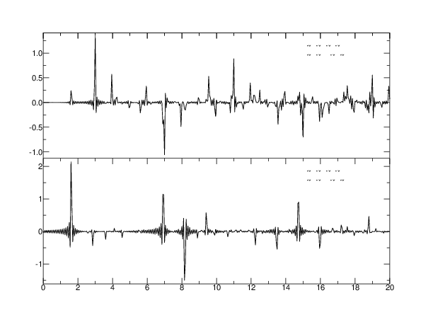

# Syn_seis

Software to compute synthetic seismograms for an incidence P or SV wave to 1-D layered structure.

(c) Takeshi Akuhara 2020

Earthquake Research Institute, The University of Tokyo 

## Installation 
1. `cd src`
2. `make`

It requires FFTW3 and SAC libraries on our machine. The paths for these libraries must be specified in `src/Makefile`.
If the SAC commands are already available, `sac-config --cflags --libs sacio` will display the paths to the SAC library.

## Sample run
1. `bin/syn_seis < sample/test.in`

* Don't forget to put "<".

## How to use
The program reads parameters and a velocity model from the standard input. The formats are:

* Line 1: [output file index]
* Line 2: [number of elements in output time series] [sampling interval (s)] [Time shift (s)]
* Line 3: [number of layers] [ray parameter (s/km)] [phase type: 1 for P; -1 for S]
* Lines 4...: [Vp (km/s)] [Vs (km/s)] [density (g/cm^3)] [thickness (km)]

### Note: 
* For ocean setting, set Vs < 0 for the topmost layer. In this case, the receiver is assumed to be placed on the seafloor (i.e., layer 1-2 boundary).
* Thickness of the bottom layer is just ignored.
* Output is SAC format. t=0 corresponds to the timing when incidence wave passes through the deepest layer interface (i.e., top of the half-space). 
